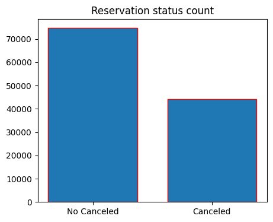
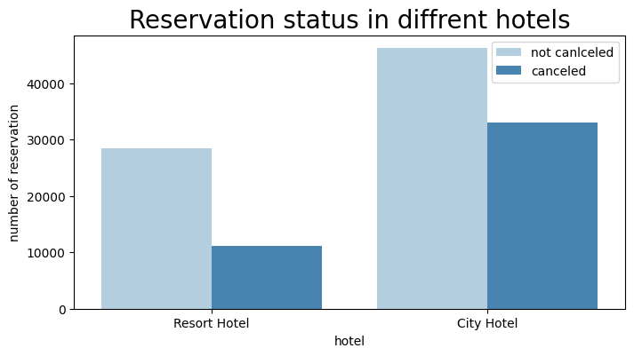
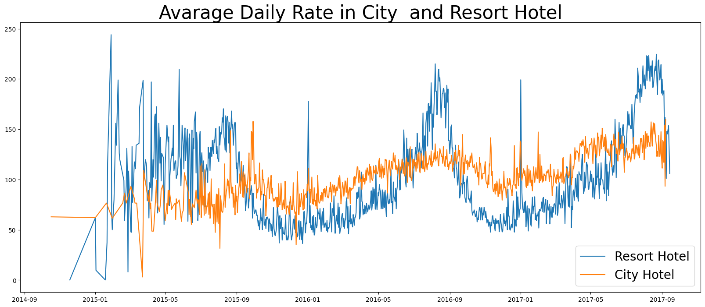
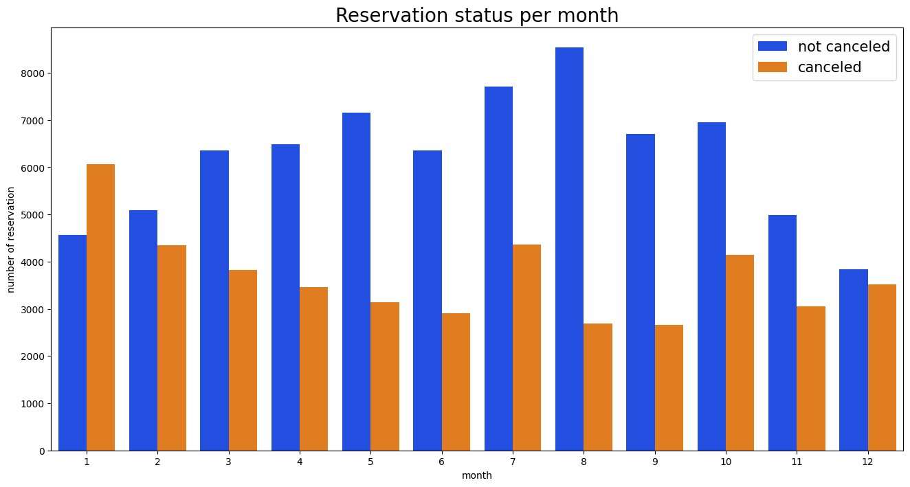
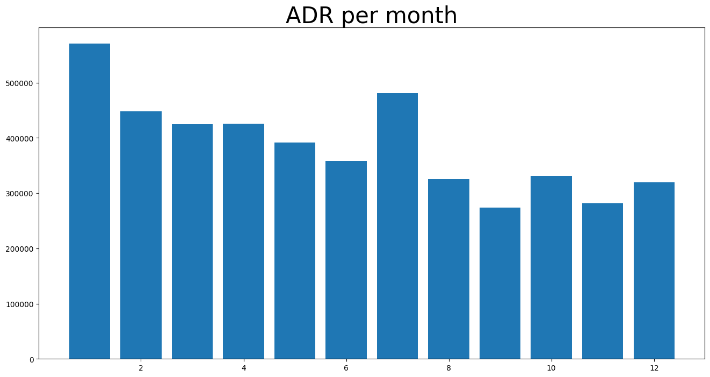
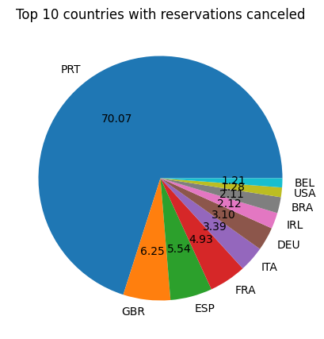
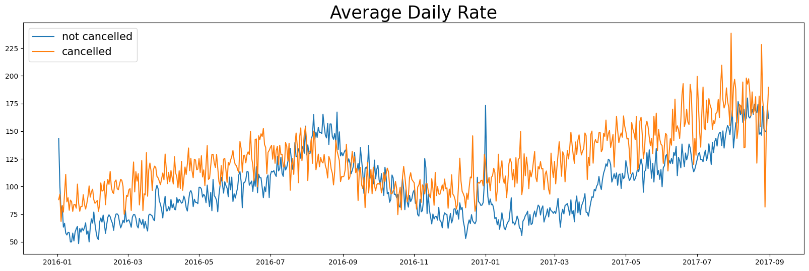

**Hotel Booking Data set**

**<u>Business Problem</u>**

In recent years, City Hotel and Resort hotel have seen high cancellation
rates. Each hotel is now dealing with a number of issues as a result,
including fewer revenues and less than ideal hotel room use.
Consequently, lowering Cancellation rates is both hotels primary goal in
order to increase their efficiency in generating revenue, and for us to
offer thorough business to address this problem.

The analysis of hotel booking cancellations as well as other factors
that have no bearing on their business and yearly revenue generation are
the main topics of this report.

**Assumptions**

> 1\. Any events outside the ordinary that occurred between 2015 and
> 2017 will not significantly impact the data in use.
>
> 2\. The information remains up-to-date and is suitable for efficient
> analysis of a hotel's potential strategies.
>
> 3\. There are no unexpected drawbacks to the hotel's adoption of any
> recommended techniques.
>
> 4\. Currently, none of the suggested solutions are in use by the
> hotels.
>
> 5\. The most influential factor affecting income generation is the
> occurrence of booking cancellations.
>
> 6\. Cancellations result in unoccupied rooms for the originally
> reserved duration.
>
> 7\. Clients tend to make hotel reservations in the same year as their
> cancellations.

**Research Question**

1\. Which factors influence the cancellation of hotel reservations?

2\. What strategies can be employed to improve the handling of hotel
reservation cancellations?

3\. In what ways will hotels receive support in their pricing and
promotional decision-making processes?

**<u>Hypothesis</u>**

1\. Higher prices lead to an increased rate of cancellations.

2\. A longer waitlist tends to result in a higher rate of customer
cancellations.

3\. Most clients choose to book their reservations through offline
travel agents.

**<u>Suggestions</u>**

1\. Cancellation rates tend to increase with higher prices. To mitigate
reservation cancellations, hotels could refine their pricing strategies
by reducing rates for specific locations and offering discounts to
customers.

2\. The ratio of cancellations to non-cancellations is higher for resort
hotels compared to city hotels. Therefore, hotels in resort locations
should consider offering reasonable room price discounts on weekends or
during holidays.

3\. During the month of January, hotels can launch marketing campaigns
with attractive offers to boost revenue, given that cancellations tend
to peak during this period.

4\. Enhancing the quality of hotels and their services, particularly in
Portugal, can be an effective way to reduce cancellation rates.

**<u>Analysis and Findings</u>**

The bar graph below illustrates the percentage of reservations that have
been cancelled and those that have not. It is evident that a substantial
portion of reservations remains unaffected by cancellations.
Specifically, 37% of clients still choose to cancel their reservations,
exerting a notable influence on the hotel's
revenue.

In the comparison to resort hotels, city hotels have more booking. It’s
possible that resort hotels are more expensive that those in cities.

The presented line graph indicates that, on specific days, the average
daily rate for city hotels is lower than that of resort hotels, and on
other days, it can be even lower. It is evident that weekends and
holidays often witness an increase in the rates for resort
hotels.

We've created the grouped bar graph to examine the months with the
highest and lowest reservation levels based on their status. It's clear
from the graph that both confirmed and cancelled reservations reach
their peak in August. However, it's noteworthy that January experiences
the highest number of cancelled reservations.

The bar graph demonstrates that cancellations are most common when
prices are greatest and are least common when they are lowest.
Therefore, the cost of the accommodation is solely responsible for the
cancellations

Now let’s see which country has the highest reservation cancelled the
top country is Portugal with highest number of cancellations.

Let's examine the sources from which guests are booking hotels and
making reservations, whether it's through Direct bookings, Groups,
Online travel agencies, or Offline travel agents. Approximately 46% of
clients choose to book through online travel agencies, while 27% prefer
booking as part of a group. A mere 4% of clients opt for direct bookings
by visiting the hotels in person to make their
reservations.

As depicted in the graph, reservations tend to be cancelled more
frequently when the average daily rate is higher compared to when it's
not. This graph underscores the validity of the earlier analyses,
emphasizing the direct relationship between higher prices and increased
cancellation rates.
